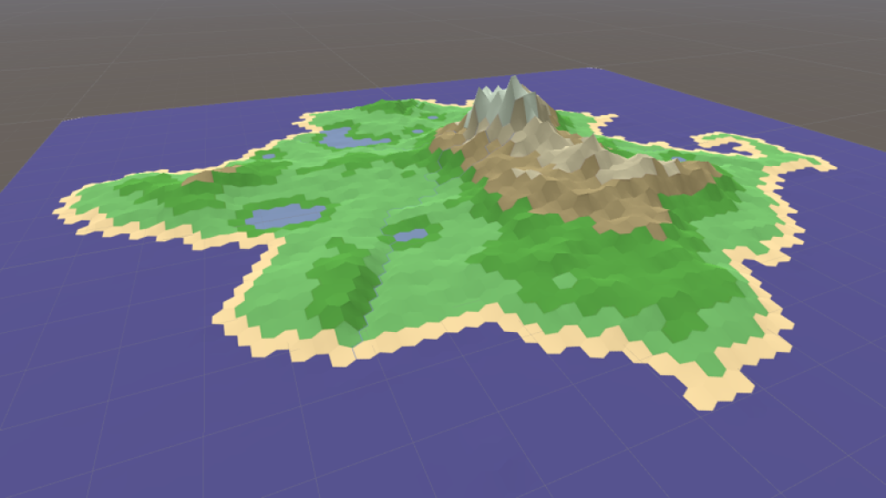
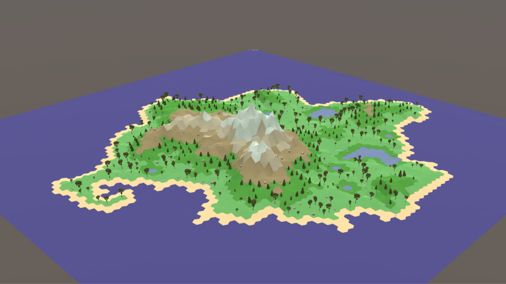

# EcoSim

I began this project with the intention of becoming familiar with [Unity](https://unity.com/) and simulations.

This was all inspired and made possible by:

- [Sebastian Lague's "Procedural Terrain Generation" series]  
- [Red Blob Games]  
- [Voronoi Map Generator]  
- ["Primer" videos]  

## Procedural Terrain Generation

After completing the *Procedural Terrain Generation* series, I happened to stumble upon the *Voronoi Map Generator* project. I used this project as a new starting point, and stripped out all the cruft that I felt was not relevant to this particular project.

After tweaking a bunch of settings, I had an island that I was reasonably happy with. There are definitely problems with this portion of the project (my mesh generation has some... oddities); in the future the mesh and texture generation will likely be improved, however it's fine for the time being.

## Environment

With an island generated, I decided it was time to implement a simple day/night cycle. This was done using a custom Skybox material, a pair of directional lights, and a simple moon texture. Essentially the sun and moon, both directional lights, always face the center of the scene, and rotate around the center point at a configured speed. This is an incredibly simple implementation but it's more than adequate for my application.

Next I thought the island could use a little more personality, so I spawned some trees and rocks using a free [low-poly texture pack] in the Asset Store (I'm no artist). There are two types of trees, a coniferous and a deciduous; coniferous trees are spawned in the `TallGrass` nodes, which are at higher elevations, and deciduous in the standard `Grass` nodes. This algorithm will likely be updated to be a bit more interesting in the future. Rocks can spawn on either `TallGrass`, `Grass`, or `Rocky` types nodes. Trees and rocks have randomized deviations on both their scales and rotations.

[Sebastian Lague's "Procedural Terrain Generation" series]: https://www.youtube.com/playlist?list=PLFt_AvWsXl0eBW2EiBtl_sxmDtSgZBxB3
[Red Blob Games]: https://www.redblobgames.com
[Voronoi Map Generator]: https://github.com/SteveJohnstone/VoronoiMapGen
["Primer" videos]: https://www.youtube.com/channel/UCKzJFdi57J53Vr_BkTfN3uQ/videos
[low-poly texture pack]: https://assetstore.unity.com/packages/3d/free-low-poly-pack-65375
